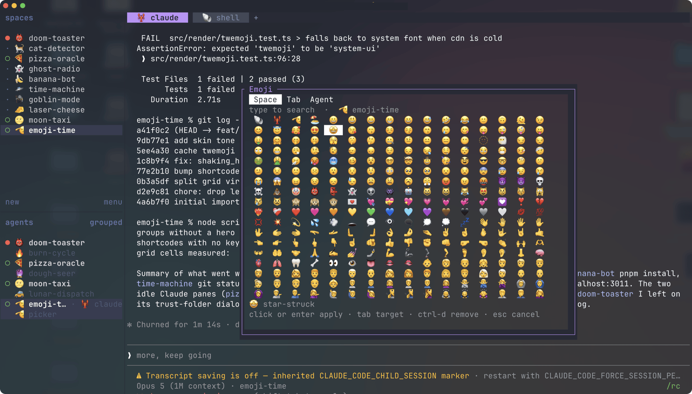

# 🍕 👻 🫡 Emoji Time 🫡 👻 🍕

Emoji for your Herdr spaces, agents and tabs, find your work at a glance and inject some fun into your terminal.



## Requirements

- [Herdr](https://herdr.dev) 0.8.2 or newer
- Python 3.9 or newer, which macOS and most Linux distributions already have
- macOS or Linux

## Install

```bash
herdr plugin install hotnugs/herdr-emoji-time
```

Or for local development:

```bash
git clone https://github.com/hotnugs/herdr-emoji-time
herdr plugin link ./herdr-emoji-time
```

## Bind a key

Herdr does not bind keys from a plugin manifest, so add one to your
`~/.config/herdr/config.toml` and reload:

```toml
[[keys.command]]
key = "prefix+shift+e"
type = "plugin_action"
command = "hotnugs.emoji-time.pick"
description = "emoji picker"
```

```bash
herdr server reload-config
```

I like `ctrl+alt+e` myself, one chord instead of two, and clear of `ctrl+e`
(end-of-line in most shells). Remap freely.

## Use it

Press `prefix` (`ctrl+b` by default) then `shift+E`, or your remapped single chord.

- Choose your emoji with the mouse or arrow keys, type to search and `enter` to select
- `tab` switches between space, tab and agent
- `ctrl-d` removes it

## License

MIT

---

Bugs and ideas: [open an issue](https://github.com/hotnugs/herdr-emoji-time/issues).

If Emoji Time helps bring joy to your terminal, consider [buying me a coffee](https://buymeacoffee.com/hotnugs).

Now go and make your sidebar less grey. 🎉
